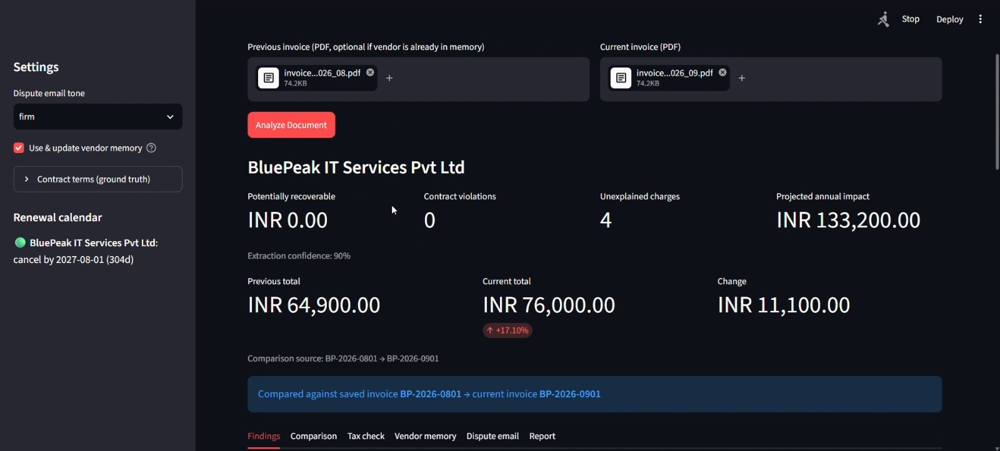
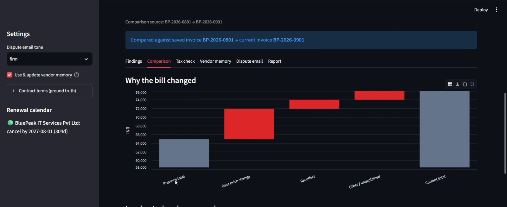
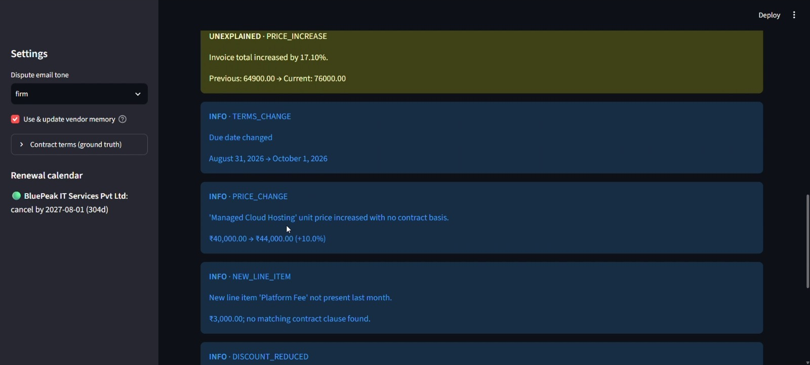
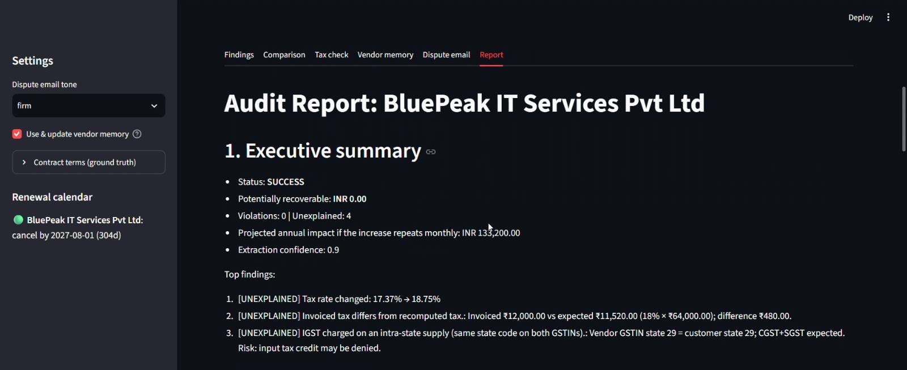
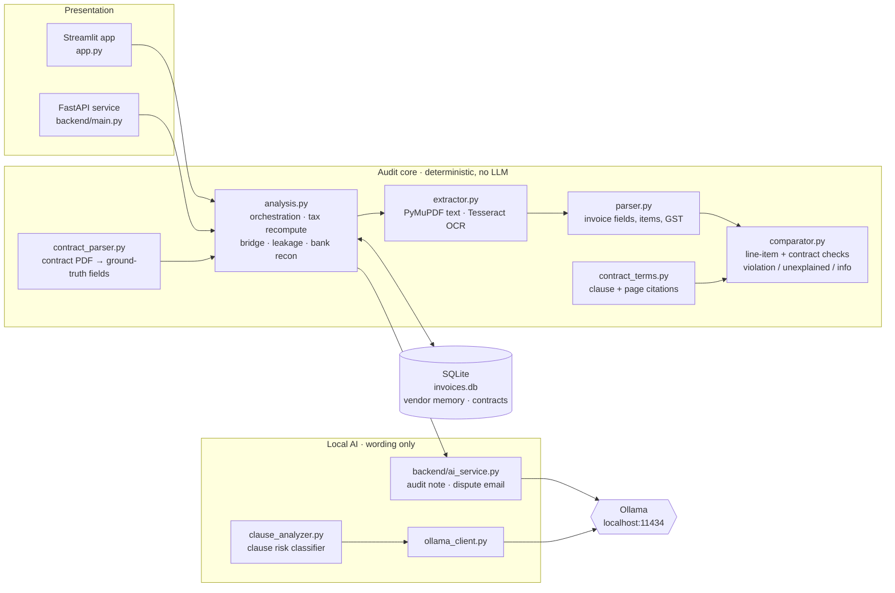
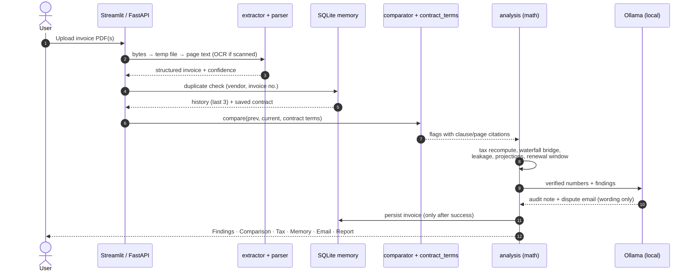

<div align="center">

# 🛡️ Sovereign Executive

### The Air-Gapped-by-Design Financial & Contract Auditor

**Catch vendor overcharges, contract violations and tax errors, with evidence, page-and-clause citations, and a ready-to-send dispute email. Local-first and air-gapped by design: documents are processed on your own machine, and the only service it talks to is a local Ollama model.**

[](https://github.com/nischithpl/Sovereign-Executive/actions/workflows/ci.yml)  

**ASYNC'26 · Track 01 · Sovereign AI**

</div>

---

## Table of Contents

1. [Context & Overview](#1-context--overview)
2. [Architecture & System Design](#2-architecture--system-design)
3. [Installation & Configuration](#3-installation--configuration)
4. [Developer Experience & Quality Control](#4-developer-experience--quality-control)
5. [Reliability, Performance & Security](#5-reliability-performance--security)
6. [Governance & License](#6-governance--license)

---

## 1. Context & Overview

### Elevator pitch

Businesses lose money quietly: a price creeps up 10%, a "Platform Fee" appears that was never agreed, a contractual discount silently disappears, GST is calculated wrongly, and an auto-renewal deadline slips by. Finance teams rarely have time to compare every invoice against a 40-page contract.

Cloud AI tools could help, but invoices and contracts are among a company's most confidential documents: uploading them to a third-party API is a non-starter for many.

**Sovereign Executive** is a **local-first, air-gapped-by-design** audit assistant (it runs fully offline; the only service it contacts is a local Ollama model). Drop in invoices (and optionally a contract); it reads them, compares them against vendor history and contract terms, and tells you *exactly* what is wrong, how much money is recoverable, and what to do next.

> **Design principle: code does the math, the LLM does the words.**
> Every number (deltas, tax recomputation, the price-bridge waterfall, leakage, projections) is plain, deterministic Python. The local LLM is only used to *write* the audit note and dispute email from those verified numbers. It can never invent a figure.

### Why we built this

Vendor overcharges rarely look like fraud; they look like a 4% price creep, a small new "platform fee", or a discount that quietly stops appearing. Across dozens of vendors and monthly invoices, that financial leakage adds up, yet nobody has time to check every bill against the contract. The obvious fix, a cloud AI tool, means uploading your most sensitive financial documents to someone else's servers. We built Sovereign Executive to give finance teams the audit power of AI **without** giving up control of their data.

### Who is it for?

| Audience | Pain it removes |
|---|---|
| SMEs & startup finance teams | No time to reconcile every vendor bill against contracts |
| Accounts-payable / procurement | Need defensible evidence to dispute charges |
| CAs & auditors (India / GST) | CGST/SGST vs IGST checks, GSTIN and ITC-risk flags |
| Regulated / privacy-sensitive orgs | Cannot send financial documents to cloud LLMs |

### Core features

| Capability | What it does |
|---|---|
| 📄 **Invoice extraction** | PDF → structured data (vendor, GSTIN, dates, line items, taxes, totals) with per-invoice confidence score; OCR fallback for scans |
| 🕒 **Vendor memory** | SQLite history per vendor; compare against past invoices automatically |
| 🔍 **Line-item comparison** | Price changes, quantity/seat changes, new fees, removed items, reduced discounts |
| 🧮 **Tax recomputation** | Re-derives GST from base × rate; detects wrong tax type (IGST vs CGST+SGST) from GSTIN state codes |
| 📑 **Contract compliance** | Extracts price points, increase caps, notice periods, fixed-price periods, discounts, liability caps, renewal terms. Checks every invoice against them |
| 📎 **Clause / page evidence** | Every violation cites the contract **page and clause number** and quotes the text |
| 📊 **Waterfall analysis** | "Why did the bill change?" broken into price, volume, new fees, discounts, tax |
| 💸 **Leakage calculation** | Recoverable amount, leakage %, and projected annual overpayment |
| ⏰ **Renewal tracking** | Auto-renewal cancel-by dates with a sidebar calendar and alerts |
| 🏦 **Bank reconciliation** | Upload a bank-statement CSV; each saved invoice is matched to a debit (amount within ₹1 **and** the vendor's name in the narration). Lists matched payments, invoices with no debit, and **debits with no invoice** |
| 📤 **Contract upload** | Upload a contract PDF; `contract_parser.py` pre-fills the agreed price, annual increase cap, renewal date, notice period and price clause for you to review and save |
| 🗂️ **Invoice history management** | Browse every saved invoice and delete entries (with a confirmation step) to keep vendor memory clean |
| 🤖 **Local AI explanation** | Executive audit note written by a local LLM (Ollama) from code-verified numbers |
| ✉️ **Dispute email drafting** | Firm or polite tone, editable, regenerable; template fallback if the model is unavailable |

### Demo: real output from the running app

> Screenshots below are captured from the running Streamlit app on the BluePeak demo dataset.

| | |
|---|---|
| <br>**Invoice analysis dashboard**: leakage, violations, projected annual impact | <br>**Waterfall / financial impact**: why the bill changed |
| <br>**Contract + evidence findings**: violation › unexplained › info | <br>**Tax check & auto-generated report** |

<!-- Optional: add a GIF or a video link -->
<!-- 🎥 **Demo video:** https://youtu.be/XXXXXXXX -->

### What it finds on the demo dataset

`make_demo_data.py` generates three BluePeak invoices (Jul/Aug/Sep 2026), a Master Services Agreement, and a bank statement with deliberately planted problems. Running the engine produces (real output):

| # | Category | Finding | Evidence |
|---|---|---|---|
| 1 | 🟥 Violation | `CONTRACT_PRICE_EXCEEDED` | Managed Cloud Hosting billed ₹44,000 vs ₹40,000 fixed price (clause 1.1) |
| 2 | 🟥 Violation | `NEW_FEE_WITHOUT_CONSENT` | ₹3,000 "Platform Fee" appeared; clause 4.2 (p.2) bars new fees without written consent |
| 3 | 🟥 Violation | `DISCOUNT_NOT_APPLIED` | Loyalty discount of ₹2,000/month (clause 1.4) missing |
| 4 | 🟥 Violation | `TAX_CALC_MISMATCH` | Invoiced tax ₹12,000 vs recomputed ₹11,520 (18% × ₹64,000) |
| 5 | 🟥 Violation | `WRONG_TAX_TYPE` | IGST charged although both GSTINs carry state code 29 → CGST+SGST expected; ITC at risk |
| 6 | 🟨 Unexplained | `TAX_TYPE_CHANGE` | CGST+SGST → IGST between invoices |
| 7 | 🟦 Info | `RENEWAL_DEADLINE` | 60-day notice window for the term ending 30 Nov 2026 closes on **1 Oct 2026** |

**Headline result:** ₹11,100 recoverable · 5 violations · 5.39% leakage · ₹1,33,200 projected annual overpayment. The bank statement additionally contains an `ADHOC RENEWAL FEE` debit (₹4,500) with no matching invoice, which bank reconciliation flags as a possible unauthorised charge.

---

## 2. Architecture & System Design

### System architecture



**Service boundaries**

| Boundary | Rule |
|---|---|
| Deterministic vs generative | `extractor → parser → comparator → analysis` never call an LLM. Only `ai_service` / `clause_analyzer` do, and only to word results. |
| Network | The application code makes no cloud API calls; its only outbound request target is the local Ollama daemon at `localhost:11434`. (Streamlit's own usage-stats setting is disabled in the run command below.) |
| Failure isolation | If Ollama is down, the audit still completes; the email falls back to a template built from the verified numbers and the UI says so. |

### End-to-end execution flow



Result statuses: `SUCCESS` · `BASELINE_ESTABLISHED` (first invoice for a vendor) · `DUPLICATE` · `ERROR`.

### Repository layout

```
Sovereign-Executive/
├── app.py                      # Streamlit UI (analysis, contracts, history, bank reconciliation)
├── analysis.py                 # Orchestration, tax recompute, bridge, leakage, bank reconciliation, report
├── make_demo_data.py           # Generates the BluePeak sample invoices, contract and bank CSV
├── backend/
│   ├── main.py                 # FastAPI REST service
│   ├── database.py             # SQLite: invoices, contracts, history, delete
│   └── ai_service.py           # Local-LLM audit note + dispute email (with deterministic fallback)
├── document_processing/
│   ├── extractor.py            # PDF → page-aware text (+ OCR fallback)
│   ├── parser.py               # Invoice text → structured data (fields, line items, GST)
│   ├── comparator.py           # Multi-invoice comparison + contract-compliance engine
│   ├── contract_terms.py       # Contract clause extraction with page/clause citations
│   └── contract_parser.py      # Contract PDF → ground-truth fields (price, cap, renewal, notice)
├── ai_engine/
│   ├── __init__.py
│   ├── clause_analyzer.py      # Standalone clause-risk classifier (cache, verify mode, fallback)
│   ├── ollama_client.py        # Thin local Ollama wrapper
│   └── prompts.py              # Few-shot prompt templates
├── tests/test_engine.py        # Deterministic-engine test suite
├── .github/workflows/ci.yml    # Lint + tests on Python 3.11 / 3.12
├── docs/screenshots/           # README images
├── requirements.txt
├── requirements-dev.txt
└── LICENSE
```

### Documentation links

| Doc | Where |
|---|---|
| Interactive REST API docs (OpenAPI / Swagger UI) | `http://localhost:8000/docs` once the API is running |
| OpenAPI JSON spec | `http://localhost:8000/openapi.json` |
| ReDoc | `http://localhost:8000/redoc` |
| Prompt design & tuning notes | [`ai_engine/prompts.py`](ai_engine/prompts.py) (module docstring) |
| Design rationale for the AI layer | [`ai_engine/clause_analyzer.py`](ai_engine/clause_analyzer.py) (module docstring) |

### REST API summary

| Method | Endpoint | Purpose |
|---|---|---|
| `GET` | `/api/health` | Liveness check |
| `POST` | `/api/upload-invoice` | Upload a PDF → full audit result (JSON) |
| `GET` | `/api/vendors/{vendor}/memory?limit=5` | Vendor invoice history, newest first (limit 1–20) |
| `PUT` | `/api/contracts` | Save/update contract ground truth for a vendor |
| `GET` | `/api/contracts/{vendor}` | Fetch a vendor's contract (404 if none) |

---

## 3. Installation & Configuration

### Prerequisites & tech stack

| Component | Requirement |
|---|---|
| Python | **≥ 3.11** (CI-tested on 3.11 and 3.12) |
| OS | Linux / macOS / Windows |
| [Ollama](https://ollama.com) | Latest; required only for AI-written notes/emails; the audit engine works without it |
| Local model | `llama3.2` (default for clause analyzer) and/or `llama3` (default for audit note/email); any Ollama model works |
| Tesseract OCR | *Optional*, only for scanned/image-only PDFs |
| Hardware | CPU-only works. A GPU or Apple Silicon makes local-LLM generation faster. |

**Stack:** Streamlit · FastAPI + Uvicorn · PyMuPDF · Tesseract/pytesseract (optional) · SQLite · Altair/pandas · Ollama · pytest · ruff

### Step-by-step installation

```bash
# 1. Clone
git clone https://github.com/nischithpl/Sovereign-Executive.git
cd Sovereign-Executive

# 2. Virtual environment
python -m venv .venv
source .venv/bin/activate            # Windows: .venv\Scripts\activate

# 3. Dependencies
pip install -r requirements.txt

# 4. (Optional but recommended) Local LLM
#    Install Ollama from https://ollama.com, then:
ollama pull llama3.2
ollama pull llama3                   # used by ai_service.py by default
ollama serve                         # skip if it already runs as a service

# 5. (Optional) OCR for scanned PDFs
#    macOS:   brew install tesseract
#    Ubuntu:  sudo apt install tesseract-ocr

# 6. Generate the demo dataset
python make_demo_data.py             # writes ./samples/*.pdf and bank_statement.csv

# 7a. Launch the UI
streamlit run app.py --browser.gatherUsageStats false   # → http://localhost:8501

# 7b. ...or launch the REST API
uvicorn backend.main:app --port 8000   # run from repo root → http://localhost:8000/docs
```

**Try it in 60 seconds:** in the UI, upload `samples/invoice_bluepeak_2026_08.pdf` as *Previous* and `samples/invoice_bluepeak_2026_09.pdf` as *Current*, save the contract terms in the sidebar (agreed price ₹40,000, cap 5%, renewal `2026-11-30`, notice 60), and click **Analyze Document**. Then upload `samples/bank_statement.csv` under *Bank reconciliation*.

### Configuration

**No `.env` file is required.** Every setting has a safe built-in default, so the app runs out of the box. The few things you may want to change are plain constants in the code:

| Setting | Description | Type | Default | Required | Where |
|---|---|---|---|---|---|
| `OLLAMA_URL` | Local Ollama endpoint | string (URL) | `http://localhost:11434/api/generate` | No | `backend/ai_service.py`, `ai_engine/ollama_client.py` |
| `DEFAULT_MODEL` (audit note / email) | Ollama model used for wording | string | `llama3` | No | `backend/ai_service.py` |
| `DEFAULT_MODEL` (clause analyzer) | Ollama model used for clause risk | string | `llama3.2` | No | `ai_engine/ollama_client.py` |
| Request timeout | Max wait for the local model | int (seconds) | `60` | No | both files above |
| `DB_FILE` | SQLite database location | path | `invoices.db` in the repo root | No | `backend/database.py` |
| Dispute-email tone | `firm` or `polite` | enum | `firm` | No | Sidebar in the UI |

---

## 4. Developer Experience & Quality Control

### Usage snippets

**Audit two invoices from Python (deterministic engine, no LLM needed):**

```python
from document_processing.parser import parse_pdf_file
from document_processing.contract_terms import extract_contract_file
from document_processing.comparator import analyze_invoice_series

invoices = [parse_pdf_file(f"samples/invoice_bluepeak_2026_0{m}.pdf") for m in (7, 8, 9)]
_, terms = extract_contract_file("samples/contract_bluepeak.pdf")

report = analyze_invoice_series(invoices, terms)
print(report["headline"]["recoverable_amount"])      # 11100.0
for f in report["flags"]:
    print(f["category"], f["type"], "-", f["description"])
```

**Full pipeline with vendor memory, tax check, bridge and AI email:**

```python
import analysis

current = analysis.parse_pdf_bytes(open("samples/invoice_bluepeak_2026_09.pdf", "rb").read())
result = analysis.run_audit(current, tone="firm", save=True, use_memory=True)
print(result["status"], result["leakage"])
print(result["dispute_email_draft"])
```

**Classify a single contract clause with the local LLM:**

```python
from ai_engine import analyze_clause

analyze_clause("The vendor may increase the fee by up to 15% on each renewal, with no customer approval.")
# {'clause_type': 'price_increase', 'risk_level': 'high', 'explanation': '...', 'evidence_text': '...'}
```

**REST:**

```bash
curl -F "file=@samples/invoice_bluepeak_2026_09.pdf" http://localhost:8000/api/upload-invoice

curl -X PUT http://localhost:8000/api/contracts -H "Content-Type: application/json" \
  -d '{"vendor_name":"BluePeak IT Services Pvt Ltd","agreed_amount":40000,"max_increase_pct":5,"renewal_date":"2026-11-30","notice_days":60}'
```

**Command-line smoke tests** (each module is runnable):

```bash
python -m document_processing.extractor samples/invoice_bluepeak_2026_09.pdf
python -m document_processing.parser    samples/invoice_bluepeak_2026_09.pdf
python -m document_processing.comparator            # runs the 3-invoice demo audit
python -m document_processing.contract_terms        # prints extracted contract terms + citations
```

### Testing & QA commands

```bash
pip install -r requirements-dev.txt

pytest -q                                                    # unit + integration tests (no Ollama/network needed)
pytest -q --cov=document_processing --cov-report=term-missing # coverage
ruff check . --select E9,F63,F7,F82                          # lint: syntax errors & undefined names
```

CI (`.github/workflows/ci.yml`) runs lint + tests + coverage on Python 3.11 and 3.12 for every push and pull request.

**What the current suite verifies (6 tests, 65% coverage of `document_processing`; `contract_parser.py` is not yet covered):** number parsing, invoice extraction at 100% confidence, contract-term extraction with page/clause citations, detection of all five planted contract violations with the exact recoverable amount (₹11,100), zero false violations on the two clean invoices, and blocking of cross-vendor comparisons.

---

## 5. Reliability, Performance & Security

### Maturity status: **Beta** (hackathon prototype, working end-to-end)

| Area | Status |
|---|---|
| Invoice extraction, comparison, tax checks, contract compliance | ✅ Working, tested |
| Vendor memory, renewal tracking, bank reconciliation | ✅ Working |
| Local AI notes/emails | ✅ Working; graceful template fallback |
| Layout coverage of invoice parsing | 🟡 Regex/heuristic, tuned for standard tabular invoices |
| Multi-currency, non-GST regimes | 🟡 Currency detected; tax logic is GST-focused |

### Benchmarks

Re-measured on the current code with the BluePeak demo data (CPU-only Linux sandbox, Python 3.12; median of repeated runs, rounded). Your hardware will differ.

| Stage | Approx. latency |
|---|---|
| Parse one text-based invoice PDF | ≈ 7 ms |
| Extract contract terms with citations (3-page MSA) | ≈ 13 ms |
| Compare 3 invoices against the contract (comparison, tax, bridge, leakage) | ≈ 1 ms |
| Local LLM audit note + email | Depends on model and hardware; 60 s timeout, then automatic fallback wording |

The deterministic audit that finds the money is effectively instant; only the optional wording step depends on the LLM.

**Reliability engineering built in:**

- Every LLM answer is normalised (case, unknown enums, missing fields) so a malformed model reply can never crash the UI.
- JSON extraction tolerates markdown fences and stray prose; one automatic retry with a stricter reminder.
- `verify=True` runs the clause classifier up to 3× and takes a majority vote to remove risk-level flip-flopping.
- In-memory result caching by clause hash; instant re-analysis.
- Ollama unreachable → rule-based clause fallback and template email; the pipeline always returns a real result.
- Invoices are saved **only after** analysis succeeds; duplicate invoice numbers are caught before any processing.
- Cross-vendor comparisons are blocked with a clear error.

### Troubleshooting & known limitations

| Symptom | Cause | Fix / workaround |
|---|---|---|
| `Local model unavailable … template` shown on the email tab | Ollama not running or model not pulled | `ollama serve`, then `ollama pull llama3` (audit note/email) and `ollama pull llama3.2` (clause analyzer). Or change `DEFAULT_MODEL` to a model you already have |
| `Could not reach Ollama at http://localhost:11434` | Ollama daemon stopped | Start `ollama serve`; the app keeps working with fallbacks in the meantime |
| Ollama times out (>60 s) | Model too large for the hardware | Use a smaller model (`ollama pull phi3`) |
| `PyMuPDF is required for PDF extraction` | Dependency missing | `pip install pymupdf` |
| Scanned PDF returns little/no text | OCR dependencies missing | `pip install pillow pytesseract` and install the Tesseract binary |
| Rupee symbol renders as `Rs.` in demo PDFs | No DejaVu/Arial font found by `make_demo_data.py` | Cosmetic only; the parser reads both `₹` and `Rs.` |
| `ModuleNotFoundError: document_processing` / `backend` | Running from the wrong directory | Run all commands from the repo root |
| Vendor name extracted with extra words (e.g. a trailing "BILL TO") | Header-line heuristic on unusual layouts | Add a `Vendor:` / `From:` label on the invoice, or correct it in the contract sidebar; extraction confidence will flag low-certainty cases |
| Line items not detected | Table header not one of `Description / Item / Particulars / Service / Details` | Add the header keyword or extend `_TABLE_HEAD` in `parser.py` |
| Invoice reported as `DUPLICATE` on re-upload | Same vendor + invoice number already in memory | Untick **Use & update vendor memory** to re-analyse without saving, or delete `invoices.db` to reset |
| Bank reconciliation misses a match | Amount differs by more than ₹1, or vendor's first word not in the narration | Adjust `tol` in `reconcile_bank()` or ensure narrations include the vendor name |

**Known trade-offs**

- Parsing is rule-based, not ML: fast, explainable and offline, but strongest on conventional invoice layouts. Low-confidence extractions are flagged for human review rather than trusted.
- Tax logic targets Indian GST (CGST/SGST/IGST, GSTIN state codes); other tax regimes get rate/arithmetic checks only.
- The LLM is intentionally never trusted with arithmetic; if Ollama is absent, wording quality drops but findings and numbers are unchanged.
- Bank reconciliation matches on amount (±₹1) plus the vendor's first word in the narration; split or partial payments are not matched.
- Vendor memory is local to the machine that ran the audit (by design: sovereignty over sync).

### Security & privacy

**Security model:** invoices, contracts and history are processed and stored on the local machine. The application code calls no cloud APIs; its only outbound request target is the local Ollama daemon at `localhost:11434`. Run Streamlit with `--browser.gatherUsageStats false` (as in the install steps) to turn off its optional usage statistics. If you later deploy this on a server, it is local-first rather than air-gapped, so apply the hardening notes below. PDF uploads are written to a random temp file (user-supplied filenames are never used) and deleted immediately after extraction.

**Hardening notes for anything beyond a local demo:**

- The bundled FastAPI service enables permissive CORS (`allow_origins=["*"]`) for local development. Restrict origins and add authentication before exposing it on a network.
- The PUT `/api/contracts` and upload endpoints have no authentication.
- `invoices.db` is unencrypted SQLite; use OS-level disk encryption for sensitive deployments.
- SQL is written with parameterised queries (no string-built SQL).

**Reporting a vulnerability: please do not open a public issue.**

Use GitHub's private vulnerability reporting: open **Security → Report a vulnerability** on [this repository](https://github.com/nischithpl/Sovereign-Executive/security/advisories/new) and include a description, reproduction steps and impact. We will respond as soon as we can and credit reporters who wish it.

---

## 6. Governance & License

### Contributing

1. Fork the repo and create a branch: `git checkout -b feat/your-change`
2. Install dev tools: `pip install -r requirements-dev.txt`
3. Make your change; **add or update tests** for any behaviour change.
4. Run `pytest -q` and `ruff check . --select E9,F63,F7,F82`. CI must be green.
5. Open a pull request describing *what* and *why*.

**Code style:** PEP 8, type hints and docstrings on public functions, small single-purpose functions, and one hard rule: **never let an LLM produce or modify a number.** Numeric logic belongs in `analysis.py` / `comparator.py`; LLM code belongs in `ai_service.py` / `ai_engine/` and only phrases verified results.

**Tuning the AI:** prompt templates live in `ai_engine/prompts.py`. To improve inconsistent answers, add another worked example in the same format.

### License

Released under the **MIT License**, see [`LICENSE`](LICENSE).

### Team

**Team ASYNC'26 · Track 01 · Sovereign AI**: built to prove that serious financial AI does not require sending your data anywhere.

